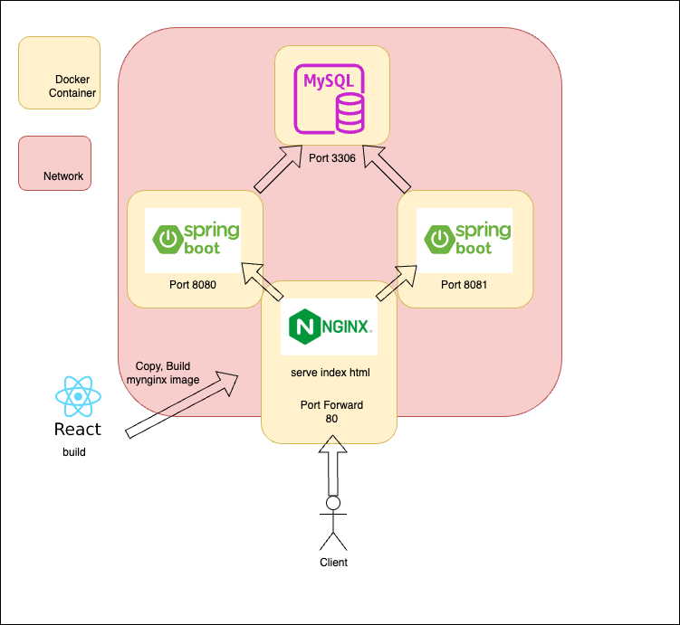

# Docker Project
***
Docker Project With Nginx, Spring Boot, React, MySQL

Automated Docker Image build and push by bash scripts.

## Project Features

---
- Board CRUD
- Authorization with JWT Token
- About Me Page
- OpenAPI Stocks Information
- TodoList

## Setup

---
```
    docker-compose up
```
then open localhost:80


## Architecture

---


## Tech Stack

---

### [server](./docs/server.md)
### [client](./docs/client.md)
### [nginx](./docs/nginx.md)

## Automation

---
For more information on automation, please see the [Automation documentation](./docs/automation.md)